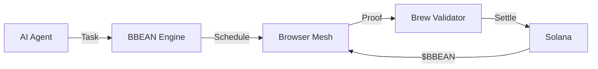

<p align="center">
  
</p>

<p align="center">
  <a href="https://github.com/BBEAN-gm/bbean-engine/actions"></a>
  <a href="https://github.com/BBEAN-gm/bbean-engine/blob/main/LICENSE"></a>
  <a href="https://github.com/BBEAN-gm/bbean-engine"></a>
  <a href="https://github.com/BBEAN-gm/bbean-engine"></a>
  <a href="https://bbean.fun"></a>
</p>

<p align="center">
  <strong>Decentralized compute orchestration engine for browser-based AI inference on Solana.</strong>
</p>

---

## What is BBEAN Engine?

BBEAN Engine is the core infrastructure behind the BBEAN network -- a decentralized physical infrastructure network (DePIN) that turns idle browser tabs into AI compute nodes. When an AI agent needs inference, BBEAN Engine schedules the task across a mesh of WebGPU-enabled browsers, validates the work through Proof-of-Brew consensus, and settles rewards on Solana.

**Open a tab. Run inference. Earn $BBEAN.**

## Architecture



| Component | Crate | Description |
|-----------|-------|-------------|
| Core Engine | `bbean-core` | Task scheduling, node registry, proof validation, runtime executor |
| Network | `bbean-network` | P2P transport, peer management, protocol messages |
| Solana Program | `bbean-solana` | On-chain reward pool, staking, token burns |
| CLI | `bbean-cli` | Node operator tooling |
| TypeScript SDK | `@bbean/sdk` | Client library for AI agents |

## Quick Start

```bash
git clone https://github.com/BBEAN-gm/bbean-engine.git
cd bbean-engine
cargo build --workspace
cargo test --workspace
```

### Run a Node

```bash
cargo run --release -p bbean-cli -- start
```

### Submit a Task (TypeScript)

```typescript
import { BbeanClient, TaskPriority } from '@bbean/sdk';

const client = new BbeanClient({
  endpoint: 'http://localhost:9420',
});

await client.connect();

const result = await client
  .task('llama-7b')
  .withPayload('Explain decentralized compute in one sentence.')
  .withPriority(TaskPriority.High)
  .submitAndWait();
