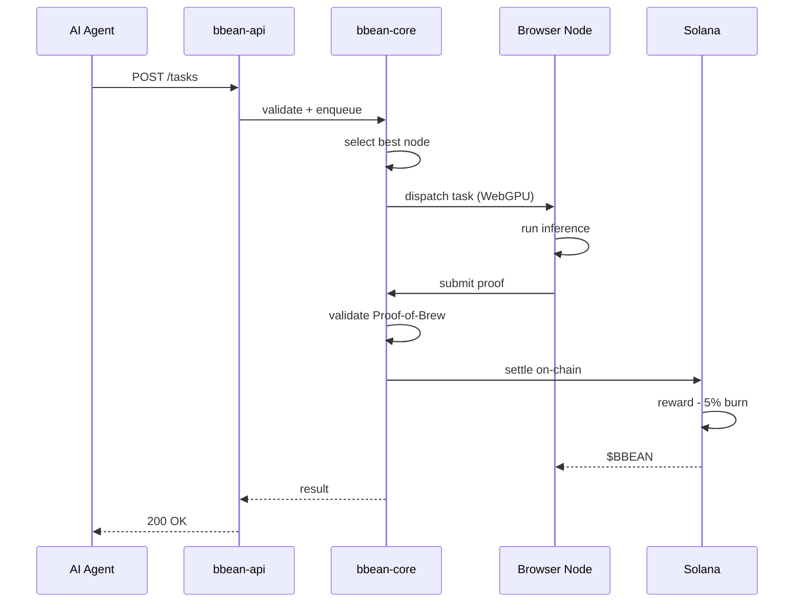

<p align="center">
  
</p>

<br>

<p align="center">
  <a href="https://github.com/BBEAN-gm/bbean-engine/blob/main/LICENSE"></a>
  <a href="https://github.com/BBEAN-gm/bbean-engine"></a>
  <a href="https://github.com/BBEAN-gm/bbean-engine"></a>
  <a href="https://bbean.fun"></a>
  <a href="https://x.com/bbeandotfun"></a>
  <a href="https://github.com/BBEAN-gm/bbean-engine"></a>
</p>

<br>

<h3 align="center">
  Your browser brews AI compute.<br>
  Open a tab. Run inference. Earn <code>$BBEAN</code>.
</h3>

<br>

<p align="center">
  <em>
    BBEAN Engine is the orchestration layer behind a decentralized compute mesh<br>
    that turns idle browser tabs into AI inference nodes on Solana.<br>
    Like a good espresso -- small footprint, high output, no waste.
  </em>
</p>

<br>

---

<br>

## The Blend

Every cup starts with the right blend. BBEAN Engine blends five crates into a single compute pipeline:

```
                         +------------------+
                         |    AI  Agent     |
                         +--------+---------+
                                  |
                           POST /tasks
                                  |
                         +--------v---------+
                         |   bbean-api      |  REST API (axum)
                         +--------+---------+
                                  |
                    +-------------+-------------+
                    |                           |
           +--------v---------+       +--------v---------+
           |   bbean-core     |       |  bbean-network   |
           |                  |       |                  |
           |  scheduler       |       |  peer manager    |
           |  node registry   |       |  ws transport    |
           |  brew validator  |       |  protocol codec  |
           |  task executor   |       |                  |
           +--------+---------+       +------------------+
                    |
                    |  proof
                    |
           +--------v---------+
           |  bbean-solana    |
           |                  |
           |  reward pool     |
           |  staking         |
           |  token burns     |
           +------------------+
```

| Crate | What it does |
|:------|:-------------|
| **bbean-api** | REST API server -- the front door. Axum-based, handles task submission, node queries, proof validation |
| **bbean-core** | The grinder. Task scheduling, priority queues, node selection, proof-of-brew validation, retry logic |
| **bbean-network** | The mesh. Peer management, WebSocket transport, protocol encoding, heartbeat monitoring |
| **bbean-solana** | The register. On-chain reward pool, staking, proof settlement, 5% deflationary burn |
| **bbean-cli** | The barista's tool. Start nodes, check status, submit tasks, manage wallets from terminal |
| **@bbean/sdk** | TypeScript client for AI agents -- submit tasks, poll results, verify proofs |

<br>

---

<br>

## Brewing Process



<br>

**Proof-of-Brew** -- our consensus mechanism:

1. Engine issues a challenge with target difficulty
2. Browser runs inference via WebGPU / ONNX Runtime Web
3. Node grinds `SHA-256(task_id || node_id || input_hash || output_hash || nonce)` until the hash has enough leading zeros
4. Proof settles on Solana, rewards flow, tokens burn

See [docs/protocol.md](docs/protocol.md) for the full spec.

<br>

---

<br>

## Grind

```bash
git clone https://github.com/BBEAN-gm/bbean-engine.git
cd bbean-engine
cargo build --workspace
cargo test --workspace
```

<br>

### Pour (Start the API server)

```bash
cargo run -p bbean-api
```

The engine listens on `http://localhost:9420` by default.

<br>

### Start a Node

```bash
cargo run -p bbean-cli -- start
```

<br>

---

<br>

## API Reference

All endpoints return JSON with this envelope:

```json
{
  "success": true,
  "data": { ... },
  "error": null
}
```

<br>

### Endpoints

<details>
<summary><code>GET</code> <code>/health</code> -- Liveness check</summary>

```bash
curl http://localhost:9420/health
```

```json
{
  "success": true,
  "data": {
    "status": "ok",
    "version": "0.1.0"
  }
}
```
</details>

<details>
<summary><code>GET</code> <code>/status</code> -- Engine status</summary>

```bash
curl http://localhost:9420/status
```

```json
{
  "success": true,
  "data": {
    "running": true,
    "version": "0.1.0",
    "uptime_secs": 3600,
    "node_count": 142,
    "port": 9420,
    "proof_difficulty": 16
  }
}
```
</details>

<details>
<summary><code>POST</code> <code>/tasks</code> -- Submit an inference task</summary>

```bash
curl -X POST http://localhost:9420/tasks \
  -H "Content-Type: application/json" \
  -d '{
    "model_id": "llama-7b",
    "payload": [72, 101, 108, 108, 111],
    "priority": "high"
  }'
```

```json
{
  "success": true,
  "data": {
    "task_id": "550e8400-e29b-41d4-a716-446655440000",
    "status": "queued",
    "queued_at": "2026-03-26T12:00:00Z",
    "estimated_wait_secs": 4
  }
}
```

| Field | Type | Required | Description |
|:------|:-----|:---------|:------------|
| `model_id` | string | yes | Target model identifier |
| `payload` | byte array | yes | Input data |
| `priority` | string | no | `low` / `normal` / `high` / `critical` |
| `callback_url` | string | no | Webhook for completion notification |
</details>

<details>
<summary><code>GET</code> <code>/tasks/{task_id}</code> -- Get task details</summary>

```bash
curl http://localhost:9420/tasks/550e8400-e29b-41d4-a716-446655440000
```
</details>

<details>
<summary><code>GET</code> <code>/tasks/{task_id}/status</code> -- Poll task status</summary>

```bash
curl http://localhost:9420/tasks/550e8400-e29b-41d4-a716-446655440000/status
```
</details>

<details>
<summary><code>GET</code> <code>/nodes</code> -- List connected nodes</summary>

```bash
curl http://localhost:9420/nodes
```

```json
{
  "success": true,
  "data": {
    "count": 142
  }
}
```
</details>

<details>
<summary><code>GET</code> <code>/nodes/{node_id}/metrics</code> -- Node performance</summary>

```bash
curl http://localhost:9420/nodes/abc123/metrics
```
</details>

<details>
<summary><code>POST</code> <code>/proofs/validate</code> -- Validate a Proof-of-Brew</summary>

```bash
curl -X POST http://localhost:9420/proofs/validate \
  -H "Content-Type: application/json" \
  -d '{
    "task_id": "abc",
    "node_id": "node-1",
    "input_hash": "deadbeef...",
    "output_hash": "cafebabe...",
    "nonce": 42,
    "difficulty": 16
  }'
```
</details>

<details>
<summary><code>GET</code> <code>/config</code> -- Current engine config</summary>

```bash
curl http://localhost:9420/config
```
</details>

<br>

---

<br>

## TypeScript SDK

```bash
git clone https://github.com/BBEAN-gm/bbean-engine.git
cd bbean-engine/sdk/typescript
npm install
npm run build
```

```typescript
import { BbeanClient, TaskPriority } from './src';

const client = new BbeanClient({
  endpoint: 'http://localhost:9420',
});

await client.connect();

// submit and wait
const result = await client
  .task('llama-7b')
  .withPayload('Explain DePIN in one sentence.')
  .withPriority(TaskPriority.High)
  .submitAndWait();

console.log(new TextDecoder().decode(result.result?.output));
```

<br>

---

<br>

## Configuration

```json
{
  "port": 9420,
  "max_nodes": 10000,
  "proof_difficulty": 16,
  "scheduler": {
    "max_queue_size": 50000,
    "task_timeout_secs": 300,
    "batch_size": 64
  },
  "solana": {
    "rpc_url": "https://api.mainnet-beta.solana.com",
    "commitment": "confirmed"
  }
}
```

Set `BBEAN_CONFIG` env var to point to your config file, or drop `config.json` in the project root.

<br>

---

<br>

## Project Structure

```
bbean-engine/
  crates/
    bbean-api/        REST API server (axum)
    bbean-core/       Scheduler, nodes, proofs, runtime
    bbean-network/    P2P: peers, transport, protocol
    bbean-solana/     On-chain: rewards, staking, burns
    bbean-cli/        Terminal tooling
  sdk/
    typescript/       TypeScript SDK for AI agents
  tests/              Integration tests
  docs/               Protocol and architecture docs
  scripts/            Setup and deployment scripts
```

<br>

---

<br>

<p align="center">
  <a href="https://bbean.fun"><strong>bbean.fun</strong></a>
  &nbsp;&nbsp;|&nbsp;&nbsp;
  <a href="https://x.com/bbeandotfun"><strong>X (Twitter)</strong></a>
  &nbsp;&nbsp;|&nbsp;&nbsp;
  <a href="https://github.com/BBEAN-gm/bbean-engine"><strong>GitHub</strong></a>
  <br><br>
  <sub>MIT License</sub>
</p>
