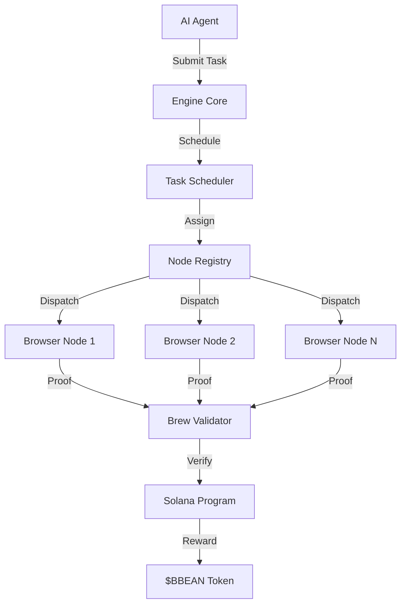
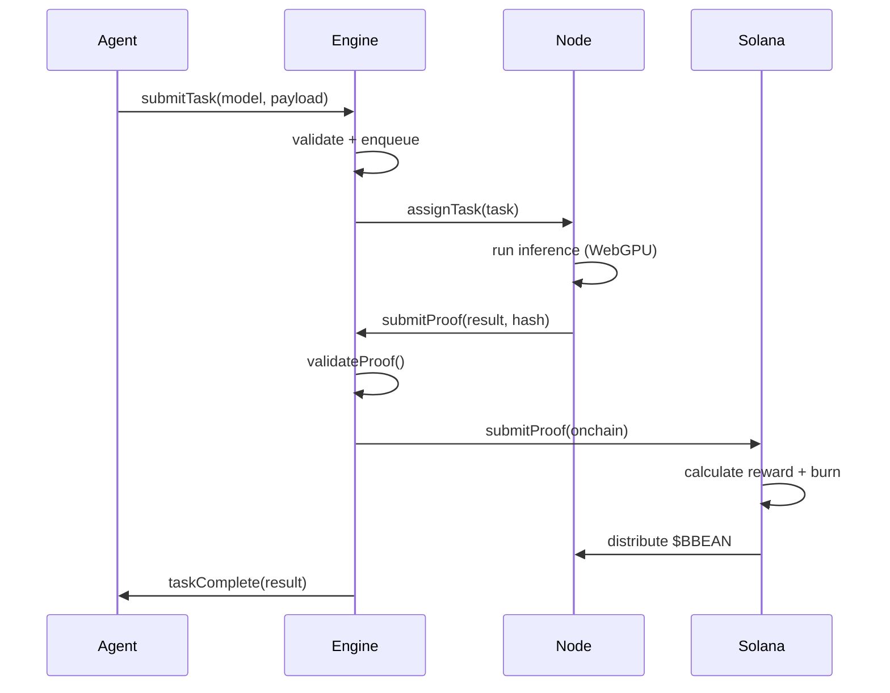

# Architecture

## Overview

BBEAN Engine is a decentralized compute orchestration system that coordinates browser-based AI inference tasks across a network of WebGPU-enabled nodes on Solana.

## System Components

## Core Engine (`bbean-core`)

The core engine handles task lifecycle management:

- **Task Scheduler**: Priority-based task queue with configurable batch processing. Tasks are distributed to nodes based on compute score and reliability metrics.
- **Node Registry**: Tracks connected browser nodes, their capabilities (WebGPU support, model size limits), and performance metrics.
- **Brew Validator**: Implements Proof-of-Brew consensus by validating SHA-256 based compute proofs with configurable difficulty.
- **Runtime Executor**: Manages concurrent task execution with semaphore-based concurrency control and automatic retry logic.

## Network Layer (`bbean-network`)

Handles peer-to-peer communication between the engine and browser nodes:

- **Peer Manager**: Connection lifecycle management with capacity limits and stale peer pruning.
- **WebSocket Transport**: Message delivery with size validation and broadcast support.
- **Protocol**: Typed message format supporting handshake, task assignment, proof submission, and heartbeat operations.

## Solana Program (`bbean-solana`)

On-chain reward distribution and staking:

- **Reward Pool**: Manages staking, reward calculation, and token burns (5% burn rate per task).
- **Instruction Processor**: Handles pool initialization, node registration, proof submission, and reward claims.
- **State Management**: Borsh-serialized on-chain accounts for nodes, tasks, and the reward pool.

## TypeScript SDK (`@bbean/sdk`)

Client library for AI agents to interact with the engine:

- **BbeanClient**: HTTP client with retry logic, connection management, and task polling.
- **TaskBuilder**: Fluent API for constructing and submitting inference tasks.
- **ProofVerifier**: Client-side proof verification using Web Crypto API.

## Data Flow

## Performance Considerations

The engine is designed to handle high throughput:

- Task queue supports up to 50,000 pending tasks
- Semaphore-based concurrency control limits parallel dispatches
- Node selection uses reliability-weighted scoring
- Batch dequeue reduces lock contention on the priority queue
